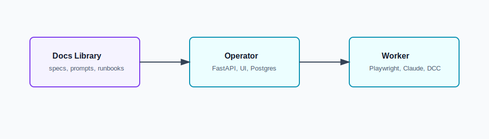

# Creative Workflow — Docs Library

> **Status:** design library, not a deployable app. Contains specs, runbooks, prompts, and skills that define how the runnable repos behave.

**Creative Workflow** is a small automation system for design agencies that work through web tools — Gemini, Freepik, Kling — instead of paid APIs. You describe a brief once; the system queues up every variation, runs the browser clicks for you across your existing accounts, and drops the results into a single dashboard you can review. One "operator" laptop runs the brain and the UI. Each designer's laptop runs a "worker" that drives their own browser sessions, so your subscriptions, cookies, and account history stay where they belong. It's a pet project, not a SaaS — built to remove the most repetitive parts of a real creative workflow without replacing the designer's judgement.

This repo is the **design library** — the *why* and the *what*, not the runnable code.

## Three repos, one project

```text
creative-workflow-docs-library   ── specs, runbooks, prompts, skills (you are here)
creative-workflow-operator       ── runs once, on the operator laptop  ──┐
                                                                          │  jobs, heartbeats, artifacts
creative-workflow-worker         ── runs on each designer's laptop    ──┘
```

To run the system, go to [`creative-workflow-operator`](https://github.com/DanilShat/creative-workflow-operator) and [`creative-workflow-worker`](https://github.com/DanilShat/creative-workflow-worker). Come back here when you want to understand the design behind a decision, change a spec, or extend the system with a new skill.

## What this repo holds

- **40 technical specs** that define how every part of the system behaves.
- **27 Ukrainian product docs** explaining the *why* behind the architecture decisions.
- **10 reusable skills** for Codex / Claude agents to extend the system.
- **Runbooks and prompts** for bootstrapping the project on a fresh pair of laptops.

## Architecture at a glance

End-to-end flow across both runnable repos, exported from **graphify**:



## Index

- `codex/` — technical specs, architecture notes, acceptance criteria, and implementation contracts.
- `runtime_docs/gate_a_runbook.md` — main runbook for the first browser-first vertical slice.
- `runtime_docs/` — setup, deployment, smoke-validation, environment, and live-browser checklists.
- `prompts/` — Codex prompt sequence used to review, build, harden, and validate the MVP.
- `skills/` — Codex skill profiles and tool-routing guidance for this project.
- `human_ua/` — Ukrainian product docs. Non-UA readers can skip this folder unless they want the original product-facing explanation.
- `archive/reviews/` — dated review snapshots kept for traceability.

## Recommended reading order

1. `README_START_HERE.md`
2. `codex/00_README_FOR_CODEX.md`
3. `codex/31_implementation_master_plan.md`
4. `runtime_docs/gate_a_runbook.md`
5. `prompts/README_ua.md`

## What's next

Spec coverage for Gate B (After Effects motion-design jobs) and Gate C (mobile reviewer flow) will land here before the runnable repos pick them up. Issues and clarification requests welcome — the spec library is the right place to debate behavior before code changes.
